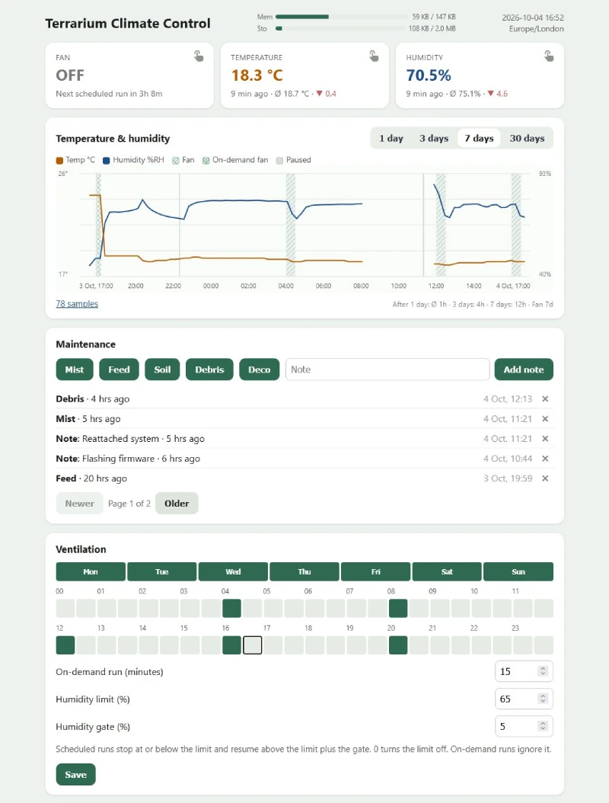
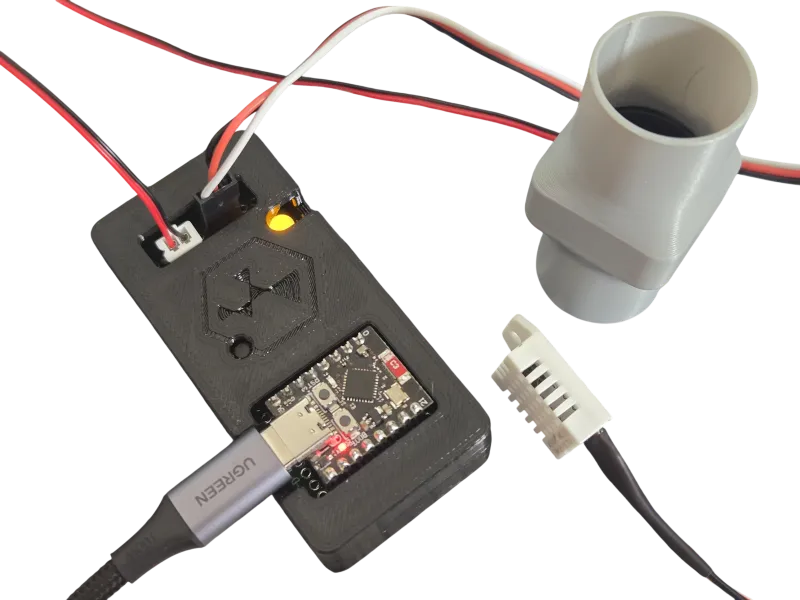
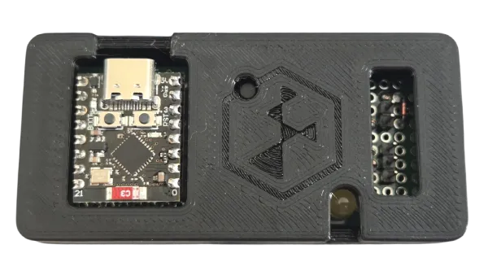

# Terrarium Climate Control

A small, low power board to run a ventilation on schedule and monitor the environment, all powered by a single USB.  
Includes a .local site with controls, up to 30 day history and a maintenance log.  



## Build



For air duct physible parts, see [printables.com](https://www.printables.com/model/1865790).  

### Parts

- ESP32-C3 board
- 5V 25mm fan
- ASAIR AM2302
- 2N2222 transistor
- 1N4007 diode (or 1N4001–1N4007, 1N5819, 1N4148)
- R1: 1 kΩ resistor
- R2: 10 kΩ resistor
- R3: 4.7 kΩ or 10 kΩ pull-up

Optional parts for fan activity and physical control:

- R4: 330 Ω resistor
- Indicator LED
- Momentary push button

### Wiring


### Flash / run

1. Install [MicroPython for ESP32-C3](https://micropython.org/download/ESP32_GENERIC_C3/).
2. Create a virtual environment in this folder and install the PC tools into it. `mpy-cross` must match the MicroPython version on the board. `mpremote` copies the built files from the command line.

Windows (PowerShell):

```powershell
python -m venv .venv
.\.venv\Scripts\Activate.ps1
python -m pip install -r requirements.txt
```

macOS / Linux:

```bash
python3 -m venv .venv
source .venv/bin/activate
python -m pip install -r requirements.txt
```

3. With that environment active, build:

```bash
python build.py
```

4. Copy `dist/*` to the board (Thonny, `mpremote`, etc.).
  ```bash
  mpremote connect auto cp dist/main.py :main.py
  mpremote connect auto cp dist/terrarium.mpy :terrarium.mpy
  mpremote connect auto cp dist/index.html :index.html
  mpremote connect auto cp dist/index.html.gz :index.html.gz
  mpremote connect auto cp wifi.cfg :wifi.cfg
  mpremote connect auto reset
  ```
5. Reset the board. Once it's on WiFi, the log shows the address & IP.
6. Open that address in a browser on the same network.

## Development

Run `preview.py` with the environment active to preview the web locally.
That serves the page at `http://127.0.0.1:8080/` with sample readings.

**Memory limit:** the board compiles `main.py` before any of it runs, and that compile needs one large free block. This doesn't leave enough memory for the WiFi. `python build.py` compiles the controller to `terrarium.mpy` on the PC and leaves the board a one-line `main.py`.

Explanations in `main.py` are `#` comments. A docstring is kept in memory for the whole compile and then thrown away, so it spends the memory WiFi needs. A comment is dropped before the compile and costs nothing. Keep new text as comments.

## Usage

- **Safe mode:** hold the button while the board powers up or resets. The controller and WiFi don't start, so Thonny or mpremote can always connect.

### Behaviour summary

| Event                              | Result                                                                 |
| ---------------------------------- | ---------------------------------------------------------------------- |
| WiFi not configured or can't connect | The fan and button still work. The board keeps retrying WiFi in the background, waiting longer between attempts, up to every 10 minutes. |
| Errors inside the loop (less than 20)         | Logged and skipped; 20 consecutive errors reset the board                    |
| Clock not synced yet               | Schedule stays off. The fan card says "Waiting for clock". On-demand still works. The board retries every minute. |
| Inside a selected half-hour on a selected day | Fan runs until that stretch ends, or at midnight if the next day is off |
| Humidity at or below the limit during a selected half-hour | Scheduled fan stops. It starts again in that stretch only after humidity rises above the limit plus the gate. On-demand runs still work. A missing reading does not flip the fan. |
| Pause recording in Advanced | Temperature, humidity, and fan history stop. The chart shows that time in gray. The fan schedule keeps running, and the humidity limit is ignored until recording resumes. |
| Selected 23:30 and 00:00, both days on | One run from 23:30 to 00:30                                       |
| A day left off                     | The fan stays off that day. The next run is the next selected day.    |
| Button or web button while fan on  | Fan stops for the rest of that stretch. A reboot can start it again.  |
| Button or web button while fan off | On-demand run                                                          |
| On-demand still running when a selected half-hour starts | The history closes the on-demand run and opens a scheduled one. The fan stays on. |
| Schedule saved on the web page     | Applies immediately and is kept after a reboot                         |

### Files on the board

| File           | Flash          | What it is                                                                                                             |
| -------------- | -------------- | ---------------------------------------------------------------------------------------------------------------------- |
| `main.py`      | yes            | Launcher on the board (`import terrarium`). In this repo it is the controller source. |
| `terrarium.mpy` | yes           | Compiled controller, written to `dist/` by `python build.py`. Copy this to the board next to the launcher. |
| `index.html`   | yes            | The web page, streamed from flash.                                                                                     |
| `index.html.gz` | yes           | Compressed copy of the page. `build.py` refreshes it. Served instead of `index.html` unless `index.html` is newer. |
| `wifi.cfg`     | yes            | WiFi credentials. Copy `wifi.cfg.example`, fill it in, and save it on the board as `wifi.cfg`.                         |
| `schedule.cfg` | no             | Created when you save Ventilation from the web page. |
| `settings.cfg` | no             | Sensor interval, log size, timezone, maintenance categories, and whether recording is paused. |
| `events.log`   | no             | Rolling log of system status, warnings, and errors. |
| `climate.hist` | no             | Temperature and humidity. |
| `fan.hist`     | no             | Fan run times.                                      |
| `pause.hist`   | no             | Times when recording was paused from Advanced. |
| `maintenance.hist` | no         | Maintenance entries. |

## Troubleshooting



### Thonny shows `serial.serialutil.SerialTimeoutException: Write timeout`

The controller is running and the serial port isn't answering. Press reset on the ESP32-C3, then press Stop in Thonny. After reset, `main.py` waits 3 seconds before the fan can start, and Stop has to land in that window so Thonny can interrupt and connect.

If that still fails, hold the button while you press reset. That is safe mode: the controller doesn't start, and the board stays at the REPL.

### The board raises `incompatible .mpy file`

`terrarium.mpy` was built with a different MicroPython version. Install the matching `mpy-cross` into `.venv` and run `python build.py` again.
