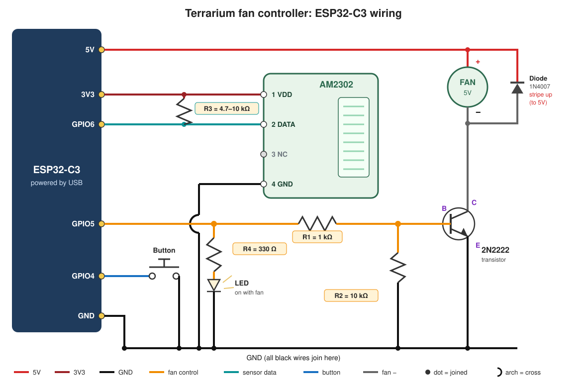
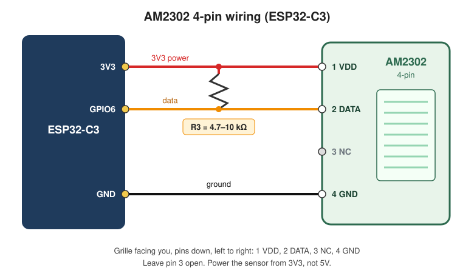

# Terrarium Climate Control

MicroPython controller that runs a fan on a schedule, with a push button and a small web page for starting and stopping it.

- **Schedule:** the fan runs during the half-hours you select, on the days you select, in local time. By default that is every day, 08:00–14:00. A humidity limit can stop a scheduled run when the air is already dry enough, and start it again only after humidity rises by a gate. On-demand runs ignore that limit. Summer time follows the timezone in `wifi.cfg`.
- **Button:** if the fan is on, it stops, and that scheduled stretch stays off until it would have ended. If the fan is off, it starts an on-demand run (5 minutes by default).
- **Web page:** shows temperature, humidity, fan status, the schedule, maintenance, a climate chart, and the log. On a narrow screen the title, chart, and log are hidden.
- **Sensor:** 4-pin ASAIR AM2302 for air temperature and relative humidity.


## Pins


| Function    | ESP32-C3 GPIO | Notes                                 |
| ----------- | ------------- | ------------------------------------- |
| Fan drive   | **GPIO21**    | HIGH = fan on (via transistor/MOSFET) |
| Fan LED     | **GPIO21**    | 330 Ω series resistor; lit when the fan is on |
| Button      | **GPIO5**     | Momentary to GND, internal pull-up    |
| AM2302 data | **GPIO1**     | Temperature / humidity sensor         |


Change `FAN_GPIO` / `BTN_GPIO` / `DHT_GPIO` at the top of `main.py` if you need different pins. Avoid GPIO 8/9 on many C3 boards (boot / USB-JTAG).

## Wiring



One USB cable powers both the board and the fan. An LED on the GPIO21 control line lights while the fan is on.

### Parts

- ESP32-C3 board
- 5V fan
- 2N2222 transistor
- R1: 1 kΩ resistor (brown-black-red)
- R2: 10 kΩ resistor (brown-black-orange)
- R4: 330 Ω resistor (orange-orange-brown)
- Indicator LED
- 1N4007 diode. Any 1N4001–1N4007, 1N5819 or 1N4148 also works.
- Momentary push button
- ASAIR AM2302 (4-pin)
- R3: 4.7 kΩ (yellow-violet-red) or 10 kΩ (brown-black-orange) pull-up


### Connections, one at a time

1. **Board 5V** → **fan +** (red wire)
2. **Fan −** → **2N2222 collector (C)**
3. **2N2222 emitter (E)** → **GND**
4. **GPIO21** → **R1 (1 kΩ)** → **2N2222 base (B)**
5. **2N2222 base (B)** → **R2 (10 kΩ)** → **GND**
6. **GPIO21** → **R4 (330 Ω)** → **LED anode** (long leg); **LED cathode** (short leg) → **GND**
7. **Diode** across the fan: **striped end → fan +**, plain end → fan −
8. **GPIO5** → **button** → **GND** (on a 4-leg button, use legs that are diagonally opposite)
9. Wire the AM2302 (see below)

R4 ties to GPIO21 on the board side of R1, the same signal that drives the transistor base. The LED lights only while the fan is on.

Every GND connection goes to the same board GND pin.

### AM2302 temperature & humidity



This is a 4-pin air temperature and humidity sensor (plastic grille, four metal pins). The main wiring diagram shows it as well.

With the grille facing you and the pins pointing down, left to right is usually:

```
1 VDD   ---------- Board 3V3
2 DATA  ---------- GPIO1
               \-- R3: 4.7 kΩ or 10 kΩ to 3V3  (pull-up)
3 NC    ---------- leave unconnected
4 GND   ---------- Board GND
```

Use **3V3**, not the board 5V pin. Keep the sensor wires reasonably short (under about 1 m). The controller reads the sensor every 15 minutes by default (5 minutes is the shortest). After a failed read it tries again every 30 seconds; the first failure and the recovery are written to the log. Successful readings stay in the climate history.

**Check the 2N2222's pinout before wiring.** Different makers order the C, B and E legs differently. For example, PN2222A is E-B-C and P2N2222A is C-B-E, read with the flat face toward you and legs pointing down. Look up the datasheet for the part number printed on yours.

If the fan stutters, or the board resets when the fan starts, the fan is drawing more than USB can supply. Power the fan from a separate 5V supply and connect that supply's GND to the board's GND.

## Files on the board


| File           | You create it? | What it is                                                                                                             |
| -------------- | -------------- | ---------------------------------------------------------------------------------------------------------------------- |
| `main.py`      | yes            | Launcher on the board (`import terrarium`). In this repo it is the controller source; `python build.py` turns it into the two files below. |
| `terrarium.mpy` | yes           | Compiled controller, written to `dist/` by `python build.py`. Copy this to the board next to the launcher. |
| `index.html`   | yes            | The web page, streamed from flash.                                                                                     |
| `index.html.gz` | yes           | Compressed copy of the page. `build.py` refreshes it. Served instead of `index.html` unless `index.html` is newer. |
| `wifi.cfg`     | yes            | WiFi credentials. Copy `wifi.cfg.example`, fill it in, and save it on the board as `wifi.cfg`.                         |
| `schedule.cfg` | no             | Created when you save Ventilation from the web page. Holds the half-hours, the on-demand run length, and the humidity limit and gate. Delete it to go back to every day, 08:00–14:00, with the humidity limit off. |
| `settings.cfg` | no             | Sensor interval, log size, timezone, maintenance categories, and whether recording is paused. Saved from Advanced on the web page. |
| `events.log`   | no             | Rolling log of system status, warnings, and errors. Fan runs and maintenance are kept in their own files, not here. How many lines are kept is set under Advanced (default 100, max 250). |
| `climate.hist` | no             | Temperature and humidity. The last day is kept as read; older samples are averaged (1 hour, then 4 hours, then 12 hours) and dropped after 30 days. |
| `fan.hist`     | no             | Fan run start/end times for the last 7 days, drawn as hatched bands on the chart.                                      |
| `pause.hist`   | no             | Times when recording was paused from Advanced. The chart draws those stretches gray. An open pause is kept in `settings.cfg` until recording starts again. Kept for 30 days. |
| `maintenance.hist` | no         | Mist, feed, soil, decoration, and notes by default. The button names are a comma-separated list under Advanced. Note is always available. Kept for 30 days, or the newest 100 if there are more. The page shows five at a time. |


`wifi.cfg`:

```
ssid=YourNetworkName
password=YourWifiPassword
hostname=terrarium1
timezone=Europe/London
```

`hostname` is optional and defaults to `terrarium`. It makes the page available at `http://terrarium1.local/` as well as at the IP address. Use letters, digits and hyphens only, and give each board a different name. `.local` addresses work on Windows 10 and later, macOS, iOS and most Linux systems. Some Android phones don't support them; use the IP address there.

`timezone` sets local time for the schedule, the log, and the chart. Summer time is applied for the built-in zones: `UTC`, `Europe/London`, `Europe/Paris`, `America/New_York`, `America/Chicago`, `America/Denver`, and `America/Los_Angeles`. The default is `Europe/London`. An older file that only has `utc_offset_hours` keeps that fixed offset and does not follow summer time. Saving Advanced stores the timezone in `settings.cfg`, and that choice wins over `wifi.cfg`.

## Flash / run

1. Install [MicroPython for ESP32-C3](https://micropython.org/download/ESP32_GENERIC_C3/).
2. Create a virtual environment in this folder and install the PC tools into it. `mpy-cross` must match the MicroPython version on the board. `mpremote` copies the built files from the command line.

Windows (PowerShell):

```powershell
python -m venv .venv
.\.venv\Scripts\Activate.ps1
python -m pip install -r requirements.txt
```

macOS / Linux:

```bash
python3 -m venv .venv
source .venv/bin/activate
python -m pip install -r requirements.txt
```

3. With that environment active, build:

```bash
python build.py
```

4. Copy `dist/main.py`, `dist/terrarium.mpy`, `dist/index.html`, `dist/index.html.gz`, and `wifi.cfg` to the board (Thonny, `mpremote`, etc.). The board's `main.py` is only `import terrarium`. The controller itself is `terrarium.mpy`, so the board does not compile it.
5. Reset the board. Once it's on WiFi, the log shows a line like:
  `WiFi: connected. Device IP: 192.168.1.42  ->  http://192.168.1.42/`
6. Open that address in a browser on the same network.

To look at the page on this computer, without the board, run this with the environment active:

```bash
python preview.py
```

That serves the page at `http://127.0.0.1:8080/` with sample readings. `preview.py` uses only the Python standard library.

```bash
mpremote connect auto cp dist/main.py :main.py
mpremote connect auto cp dist/terrarium.mpy :terrarium.mpy
mpremote connect auto cp dist/index.html :index.html
mpremote connect auto cp dist/index.html.gz :index.html.gz
mpremote connect auto cp wifi.cfg :wifi.cfg
mpremote connect auto reset
```

If an older `main.py` (the full controller) is still on the board, delete it before copying `dist/main.py`, or the copy replaces it. Leave `terrarium.mpy` next to that launcher. If `terrarium.mpy` was built with a different MicroPython version, the board raises `incompatible .mpy file`. Install the matching `mpy-cross` into `.venv` and run `python build.py` again.

If WiFi isn't configured or can't connect, the fan and button still work. The board keeps retrying WiFi in the background, waiting longer between attempts, up to every 10 minutes.

The web page has no password. Anyone on your network can open it. Other websites you visit can't press its buttons: the board only accepts changes sent as JSON, which browsers won't send across sites without permission the board never gives.

Errors inside the loop are logged and skipped; 20 in a row reset the board.

**Safe mode:** hold the button while the board powers up or resets. The controller and WiFi don't start, so Thonny or mpremote can always connect.

**Memory limit:** the board compiles `main.py` before any of it runs, and that compile needs one large free block. The WiFi driver needs the same kind of block. `python build.py` compiles the controller to `terrarium.mpy` on the PC and leaves the board a one-line `main.py`, so that compile happens on the PC instead.

Explanations in `main.py` are `#` comments. A docstring is kept in memory for the whole compile and then thrown away, so it spends the memory WiFi needs. A comment is dropped before the compile and costs nothing. Keep new text as comments.

## Behaviour summary


| Event                              | Result                                                                 |
| ---------------------------------- | ---------------------------------------------------------------------- |
| Clock not synced yet               | Schedule stays off. The fan card says "Waiting for clock". On-demand still works. The board retries every minute. |
| Inside a selected half-hour on a selected day | Fan runs until that stretch ends, or at midnight if the next day is off |
| Humidity at or below the limit during a selected half-hour | Scheduled fan stops. It starts again in that stretch only after humidity rises above the limit plus the gate. On-demand runs still work. A missing reading does not flip the fan. |
| Pause recording in Advanced | Temperature, humidity, and fan history stop. The chart shows that time in gray. The fan schedule keeps running, and the humidity limit is ignored until recording resumes. |
| Selected 23:30 and 00:00, both days on | One run from 23:30 to 00:30                                       |
| A day left off                     | The fan stays off that day. The next run is the next selected day.    |
| Button or web button while fan on  | Fan stops for the rest of that stretch. A reboot can start it again.  |
| Button or web button while fan off | On-demand run                                                          |
| On-demand still running when a selected half-hour starts | The history closes the on-demand run and opens a scheduled one. The fan stays on. |
| Schedule saved on the web page     | Applies immediately and is kept after a reboot                         |


## Troubleshooting

**Thonny shows `serial.serialutil.SerialTimeoutException: Write timeout`.** The controller is running and the serial port isn't answering. Press reset on the ESP32-C3, then press Stop in Thonny. After reset, `main.py` waits 3 seconds before the fan can start, and Stop has to land in that window so Thonny can interrupt and connect.

If that still fails, hold the button while you press reset. That is safe mode: the controller doesn't start, and the board stays at the REPL.


